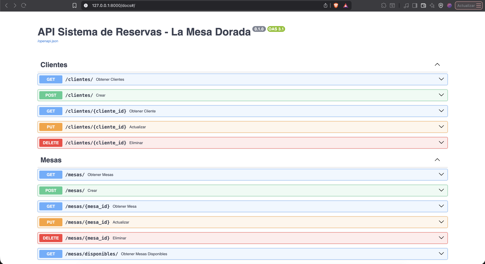
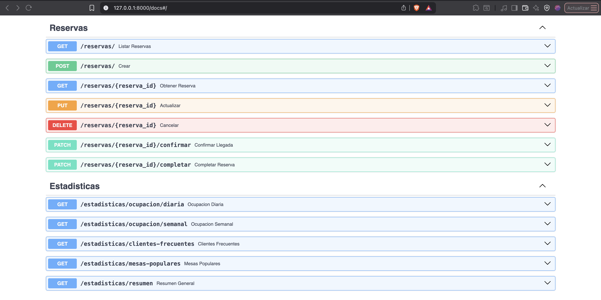
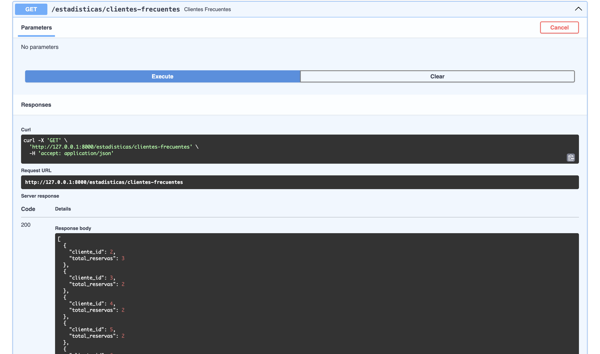
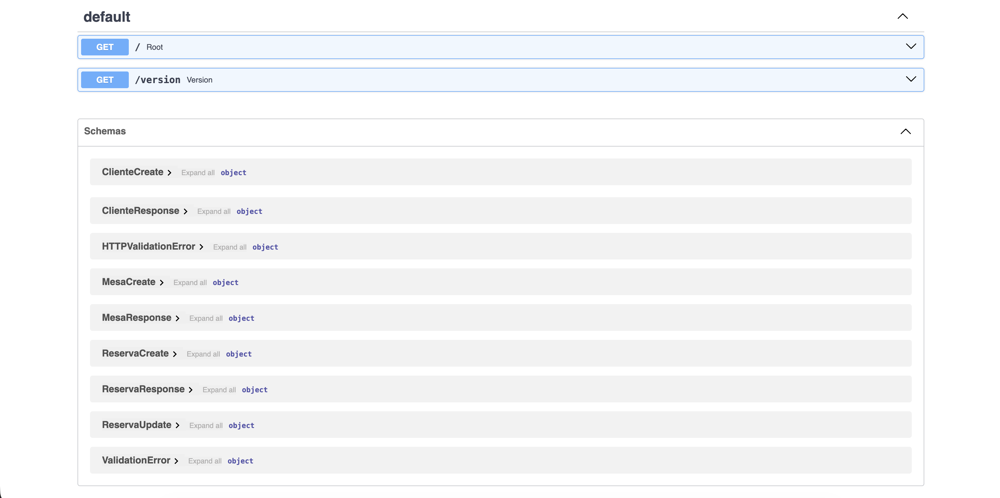

# API de Reservas del Restaurante

Este proyecto es una API REST para gestionar clientes, mesas, reservas y estadísticas de un restaurante. Sirve para registrar clientes, administrar la disponibilidad de mesas, crear y actualizar reservas, y consultar métricas básicas del negocio.

## Requisitos previos

- Python 3.8 o superior
- pip
- SQLite (incluido con Python)

## Instalación paso a paso

1. Clona el proyecto desde GitHub:
	`git clone https://github.com/saadCoding-00/reservas_restaurante_API.git`
	o descarga el proyecto en ZIP.
2. Entra en la carpeta del proyecto.
3. Crea un entorno virtual (opcional, pero recomendado para evitar problemas de versiones de python).
4. Instala dependencias con `pip install -r requirements.txt`.

## Cómo ejecutar la aplicación

1. En la raíz del proyecto, ejecuta `uvicorn app.main:app --reload`.
2. Abre el navegador en `http://127.0.0.1:8000`.
3. Para probar endpoints, usa Swagger en `http://127.0.0.1:8000/docs`.

## Estructura del proyecto

- app/
	- main.py: punto de entrada de la API.
	- database.py: conexión y helpers de base de datos.
	- models/: modelos Pydantic (Cliente, Mesa, Reserva).
	- services/: lógica de negocio.
	- routers/: endpoints de la API.
	- exceptions/: excepciones personalizadas.
- data/: base de datos SQLite.
- tests/: pruebas (si aplica).

## Ejemplos de uso (endpoints principales)

### Clientes
- GET /clientes: listar clientes.
- GET /clientes/{id}: obtener cliente por id.
- POST /clientes: crear cliente.
- PUT /clientes/{id}: actualizar cliente.
- DELETE /clientes/{id}: eliminar cliente.

### Mesas
- GET /mesas: listar mesas.
- GET /mesas/{id}: obtener mesa por id.
- POST /mesas: crear mesa.
- PUT /mesas/{id}: actualizar mesa.
- DELETE /mesas/{id}: eliminar mesa.

### Reservas
- GET /reservas: listar reservas (con filtros).
- GET /reservas/{id}: obtener reserva por id.
- POST /reservas: crear reserva.
- PUT /reservas/{id}: actualizar reserva.
- DELETE /reservas/{id}: cancelar reserva.
- PATCH /reservas/{id}/confirmar: confirmar llegada.
- PATCH /reservas/{id}/completar: marcar como completada.

### Estadísticas
- GET /estadisticas/ocupacion/diaria?fecha=YYYY-MM-DD
- GET /estadisticas/ocupacion/semanal?fecha_inicio=YYYY-MM-DD
- GET /estadisticas/clientes-frecuentes
- GET /estadisticas/mesas-populares
- GET /estadisticas/resumen

## Capturas del funcionamiento

### Endpoints en la web

### Swagger (docs)

## Autor y fecha

Autor: Saad Faham
Fecha: 11 de febrero de 2026